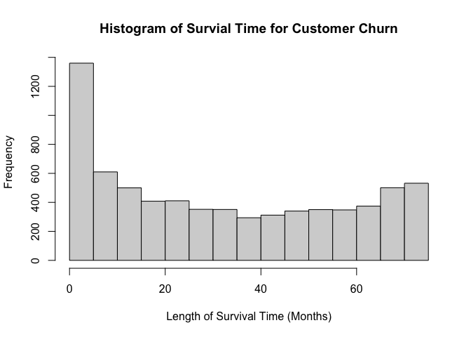
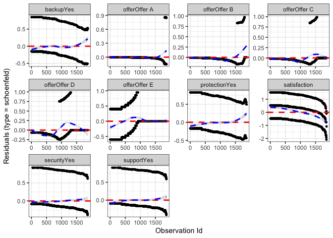

Survival Analysis of Customer Time-to-Churn
================
Corey Neff
6/25/2021

## Introduction

This is a short project investigating customer time-to-churn of a public
dataset. The main goal is to discover the role that subscribing to
multiple services at this company plays in probability of churn, but it
will also consider customer satisfaction, as well.

We will start by reading the data, and turning churn value (“Yes”, “No”)
into a factor, while doing some basic visualizations.

``` r
librarian::shelf(survival, survminer, dplyr, ggplot2)
```

    ## 
    ##   The 'cran_repo' argument in shelf() was not set, so it will use
    ##   cran_repo = 'https://cran.r-project.org' by default.
    ## 
    ##   To avoid this message, set the 'cran_repo' argument to a CRAN
    ##   mirror URL (see https://cran.r-project.org/mirrors.html) or set
    ##   'quiet = TRUE'.

``` r
survdata <- read.csv("survival.csv")


head(survdata, n=5)
```

    ##   X         id months   offer phone multiple internet_type gb_mon security
    ## 1 0 8779-QRDMV      1    None    No       No           DSL      8       No
    ## 2 1 7495-OOKFY      8 Offer E   Yes      Yes   Fiber Optic     17       No
    ## 3 2 1658-BYGOY     18 Offer D   Yes      Yes   Fiber Optic     52       No
    ## 4 3 4598-XLKNJ     25 Offer C   Yes       No   Fiber Optic     12       No
    ## 5 4 4846-WHAFZ     37 Offer C   Yes      Yes   Fiber Optic     14       No
    ##   backup protection support unlimited       contract paperless         payment
    ## 1     No        Yes      No        No Month-to-Month       Yes Bank Withdrawal
    ## 2    Yes         No      No       Yes Month-to-Month       Yes     Credit Card
    ## 3     No         No      No       Yes Month-to-Month       Yes Bank Withdrawal
    ## 4    Yes        Yes      No       Yes Month-to-Month       Yes Bank Withdrawal
    ## 5     No         No      No       Yes Month-to-Month       Yes Bank Withdrawal
    ##   monthly total_revenue satisfaction churn_value churn_score cltv
    ## 1   39.65         59.65            3           1          91 5433
    ## 2   80.65       1024.10            3           1          69 5302
    ## 3   95.45       1910.88            2           1          81 3179
    ## 4   98.50       2995.07            2           1          88 5337
    ## 5   76.50       3102.36            2           1          67 2793

``` r
survdata$churn_factor <- as.factor(survdata$churn_value)
hist(survdata$months, xlab="Length of Survival Time (Months)", main="Histogram of Survial Time for Customer Churn")
```

<!-- -->

## First Kaplan-Meier Curve

Kaplan-Meier Curves are a non-parametric way to vizualize survival data
such as these. The Kaplan-Meier survival curve is defined as the
probability of “surviving” in a given length of time while considering
time in many small intervals. Here, “survival time” is the time-to-churn
(i.e. length of time before a cutomer stopped using services, or
customer attrition).

``` r
survfit1 <- survfit(Surv(months, churn_value) ~ 1, data = survdata)
basic_plot <- ggsurvplot(survfit1,
           conf.int = T,
           conf.int.fill = "red",
           ylim = c(0.5, 1),
           xlim = c(0, max(survdata$months)),
           xlab = "Time (months)",
           legend = "none",
           title = "Kaplan-Meier Curve for Time to Customer Churn (full sample)",
           ggtheme = theme_bw())
print(basic_plot)
```

<!-- -->

## Multiple Services – Important?

As we can see, change in customer churn appears to be rather linear with
respect to time, but this model includes the full sample of data. I’d
like to know how the number of services a customer is subscribed to
affects survival time. Do customers with less services (i.e. a single
service) churn faster than those with more? First we will start with a
simple bar chart vizualization to begin to investigate this issue.

``` r
multiple <- survdata %>%
                  filter(multiple == "Yes") %>%
                  ggplot() + 
                        geom_histogram(aes(x = months, fill  = as.factor(churn_value)), bins = 11) +
                        scale_fill_discrete(name = "Churned?", labels = c("No", "Yes")) +
                        ggtitle("Customers with Multiple Services") +
                        xlab("Time (months)")+
                        theme_bw()

single <-   survdata %>%
                  filter(multiple == "No") %>%
                  ggplot() + 
                        geom_histogram(aes(x = months, fill  = as.factor(churn_value)), bins = 11) +
                        scale_fill_discrete(name = "Churned?", labels = c("No", "Yes")) +
                        ggtitle("Customers with a Single Service")+
                        xlab("Time (months)") +
                        theme_bw()

egg::ggarrange(plots = list(single, multiple), nrow = 1)
```

<!-- -->

## Kaplan-Meier Estimator Part Deux

As we can see, customers subscribing to multiple services tend to
survive (i.e. not churn) a much longer time than those subscribed to a
single service. We will be able to see this a bit more clearly with
another Kaplan-Meier Curve.

``` r
survfit2 <- survfit(Surv(months, churn_value) ~ multiple, data = survdata)
services_plot <- ggsurvplot(survfit2,
           conf.int = T,
           risk.table = TRUE,
           tables.height = 0.2,
           tables.theme = theme_cleantable(),
           ylim = c(0.5, 1),
           xlim = c(0, max(survdata$months)),
           xlab = "Time (months)",
           legend.title = "Services",
           legend.labs = c("Single", "Multuple"),
           title = "Kaplan-Meier Curve for Time to Customer Churn (full sample)",
           ggtheme = theme_bw())
print(services_plot)
```

<!-- -->

## Cox Proportional Hazards – Univariate

So, it seems that customers subscribed to a single service tend to face
attrition at a generaly faster rate early-on. That is, early in their
patronage, they are much more likely to churn than those subsccribed to
multiple services. In the long-run, however, the survival probaility
appears to be about the same for both groups.

Now we will begin to investigate a semi-parametric route – the Cox
Proportional Hazards Model, specifically. Cox models handle multiple
covariates much better, which will be useful later. In addition, in a
Cox proportional hazards regression model, the measure of effect is the
hazard rate, which is the risk of failure (i.e., the risk or probability
of suffering the event of interest), given that the participant has
survived up to a specific time. Comparing hazard rates allows us to
create a hazard ratio, which is similar to an odds ratio.

``` r
coxfit1 <- coxph(Surv(months, churn_value) ~ multiple, data = survdata)
summary(coxfit1)
```

    ## Call:
    ## coxph(formula = Surv(months, churn_value) ~ multiple, data = survdata)
    ## 
    ##   n= 7043, number of events= 1869 
    ## 
    ##                 coef exp(coef) se(coef)      z Pr(>|z|)    
    ## multipleYes -0.23780   0.78836  0.04701 -5.059 4.22e-07 ***
    ## ---
    ## Signif. codes:  0 '***' 0.001 '**' 0.01 '*' 0.05 '.' 0.1 ' ' 1
    ## 
    ##             exp(coef) exp(-coef) lower .95 upper .95
    ## multipleYes    0.7884      1.268     0.719    0.8644
    ## 
    ## Concordance= 0.551  (se = 0.006 )
    ## Likelihood ratio test= 25.72  on 1 df,   p=4e-07
    ## Wald test            = 25.59  on 1 df,   p=4e-07
    ## Score (logrank) test = 25.7  on 1 df,   p=4e-07

``` r
cox_services <- ggadjustedcurves(coxfit1, variable = "multiple",
                 ylim = c(0.5, 1),
                 ggtheme = theme_bw(),
                 xlab = "Time (months)",
                 legend.title = "Multiple Services",
                 legend.labs = c("Single", "Multuple"),
                 title = 'Survival Curves for Cox Proportional Hazards Model, by Number of "Services"') 
print(cox_services)
```

<!-- -->

## Cox Proportional Hazards Model – Multivariate

The Cox distribution yields similar conclusions to the Kaplan-Meier
curve before. Generally, people with multiple services have a higher
survival rate with respect to time. From the output, we might turn our
attention to the exponentiated coefficient of multiple services
variable: 0.788. FIn this case, subscribing to multiple services reduces
the hazard by a factor of 0.79, or 21%. Therefore, subscribing to
multiple services is associated with a good prognosis as far as churn
goes. Additionally, we can see that the covariate and model are both
significant.

Now that we understands that, generally, subscribing to multiple
services corresponds to less churn, I think a solid next step would be
to see which services in particular are better in this regard. With that
in mind, this next model will include the individual services being
subscribed to (security, backup, protection, and support) as well as
customer satisfaction and offer type, for good measure.

``` r
coxfit2 <- coxph(Surv(months, churn_value) ~ security + backup + protection + support + satisfaction + offer, data = survdata)
summary(coxfit2)
```

    ## Call:
    ## coxph(formula = Surv(months, churn_value) ~ security + backup + 
    ##     protection + support + satisfaction + offer, data = survdata)
    ## 
    ##   n= 7043, number of events= 1869 
    ## 
    ##                   coef exp(coef) se(coef)       z Pr(>|z|)    
    ## securityYes   -0.93927   0.39091  0.06669 -14.084  < 2e-16 ***
    ## backupYes     -0.41330   0.66146  0.05494  -7.523 5.34e-14 ***
    ## protectionYes -0.35135   0.70374  0.05390  -6.519 7.10e-11 ***
    ## supportYes    -0.36163   0.69654  0.06575  -5.500 3.80e-08 ***
    ## satisfaction  -1.24121   0.28903  0.02381 -52.136  < 2e-16 ***
    ## offerOffer A  -1.62260   0.19738  0.17649  -9.194  < 2e-16 ***
    ## offerOffer B  -0.95674   0.38414  0.10606  -9.021  < 2e-16 ***
    ## offerOffer C  -0.23791   0.78827  0.10898  -2.183   0.0290 *  
    ## offerOffer D   0.22377   1.25078  0.08914   2.510   0.0121 *  
    ## offerOffer E   1.80737   6.09439  0.07323  24.679  < 2e-16 ***
    ## ---
    ## Signif. codes:  0 '***' 0.001 '**' 0.01 '*' 0.05 '.' 0.1 ' ' 1
    ## 
    ##               exp(coef) exp(-coef) lower .95 upper .95
    ## securityYes      0.3909     2.5581    0.3430    0.4455
    ## backupYes        0.6615     1.5118    0.5939    0.7367
    ## protectionYes    0.7037     1.4210    0.6332    0.7822
    ## supportYes       0.6965     1.4357    0.6123    0.7923
    ## satisfaction     0.2890     3.4598    0.2759    0.3028
    ## offerOffer A     0.1974     5.0662    0.1397    0.2790
    ## offerOffer B     0.3841     2.6032    0.3120    0.4729
    ## offerOffer C     0.7883     1.2686    0.6367    0.9760
    ## offerOffer D     1.2508     0.7995    1.0503    1.4896
    ## offerOffer E     6.0944     0.1641    5.2795    7.0351
    ## 
    ## Concordance= 0.926  (se = 0.002 )
    ## Likelihood ratio test= 5598  on 10 df,   p=<2e-16
    ## Wald test            = 4325  on 10 df,   p=<2e-16
    ## Score (logrank) test = 7157  on 10 df,   p=<2e-16

## Cox Proportional Hazards Model – Multivariate

As we can see, the model and all covariates are statistically
significant. Additionally, it seems that subscribing to the security
service yields the greatest reduction in hazard among the available
services at a hazard ratio of 0.3482. Even so, it appears that customer
satisfaction and offer type have the greatest impact on hazard as
indicated by it being the lowest hazard ratio among the included
predictors.

To investigate further, It may be beneficial to see this effect
visually.

``` r
cox_satisfaction <- ggadjustedcurves(coxfit2, variable = "satisfaction",
                 ylim = c(0, 1),
                 ggtheme = theme_bw(),
                 xlab = "Time (months)",
                 title = 'Survival Curves for Cox Proportional Hazards Model, by "Satisfaction"',
                 legend.title = "Product Satisfaction")

cox_offer <- ggadjustedcurves(coxfit2, variable = "offer",
                 ylim = c(0, 1),
                 ggtheme = theme_bw(),
                 xlab = "Time (months)",
                 title = 'Survival Curves for Cox Proportional Hazards Model, by "Offer"',
                 legend.title = "Offer Type")
egg::ggarrange(cox_satisfaction, cox_offer)
```

<!-- -->

## Cox Proportional Hazards Model – Customer Satisfaction

Customer satisfaction seems to have a particularly pronounced (and
understandable) effect on customer attrition over time. Customers
reporting high satisfaction (i.e. a 5) survive at a rate of what appears
to be nearly 100% at the end of the reporting period, while those
reporting low satisfaction (i.e. a 1) survive at an abysmal rate –
nearly entirely gone at 70 months. For that reason, the wisest business
decision may be to maintain high levels of customer satisfaction;
albeit, this is a rather unsurprising takeaway.

Offer Type, too, has a sizable effect on churn time. In particular,
*Offer E* seems to lead to much higher churn – even higher than having
no offer at all. In the absence of other information, perhaps this offer
package should be retired.

Next, lets run some diagnostics on the Cox model to test the
proportional hazards assumption. To do this, we will have a look at the
Schoenfield residuals. Schoenfeld residuals represent the difference
between the observed covariate and the expected given the risk set at
that time. They should be flat, centered about zero.

``` r
cox.zph(coxfit2)
```

    ##               chisq df       p
    ## security       11.9  1 0.00056
    ## backup         30.1  1 4.1e-08
    ## protection     46.6  1 8.8e-12
    ## support        17.1  1 3.5e-05
    ## satisfaction  187.6  1 < 2e-16
    ## offer         768.5  5 < 2e-16
    ## GLOBAL       1012.4 10 < 2e-16

``` r
ggcoxdiagnostics(coxfit2,  type = "schoenfeld")
```

    ## `geom_smooth()` using formula 'y ~ x'

<!-- -->

## Cox Proportional Hazards Model – Multivariate Diagnostics

It seems pretty clear from the Schoenfield residuals that the
proportional hazards assumption is violated. This conclusion is
validated by the *cox.zph* hypothesis test. We reject the null
hypothesis that there is no time independence. An assumption of the Cox
model is that a covariate’s influence on survival is constant with
respect to time. In this case, this is true with none of the variables.
Ultimately, this may impact the validity of the results. The easiest way
to address this shortcoming is by stratifying the data, but I am
doubtful this will help much at all. Ultimately, I think it would be
best to move forward in spite of this, with the understanding that the
assumption violation may reduce the model usefulness.
